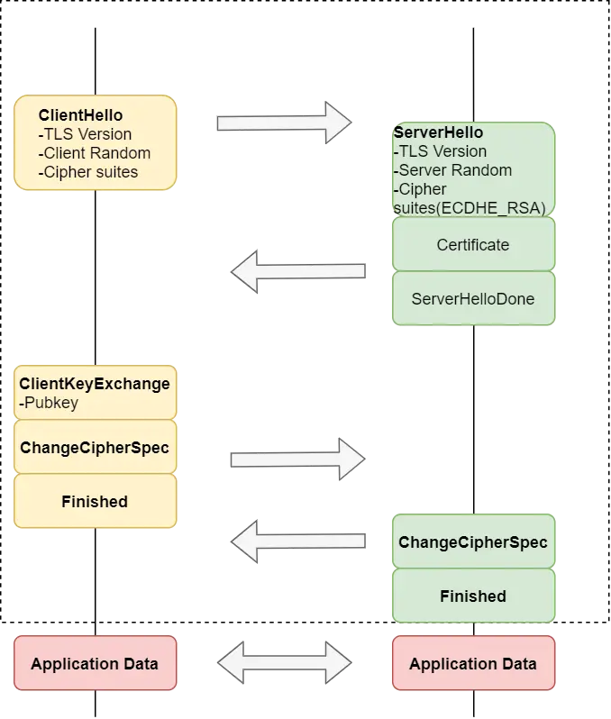
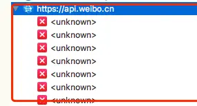
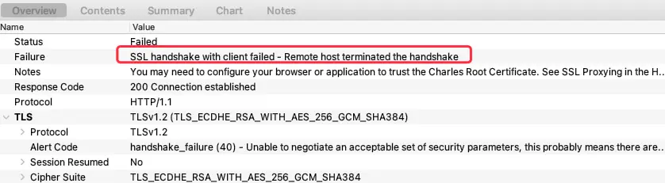
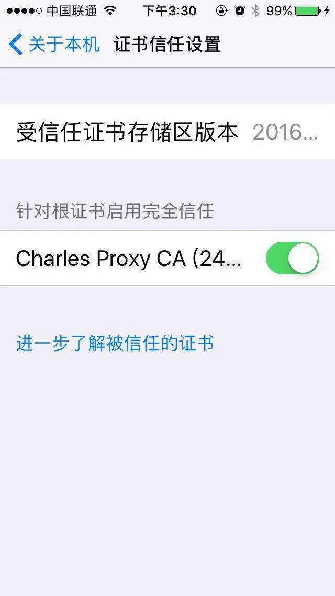
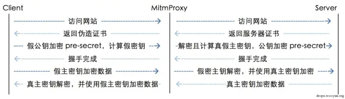

## HTTPS 的安全性

相比 HTTP，HTTPS 之所以更安全的是因为其在 HTTP 传输层之上加了一个安全层（SSL 或 TLS 协议）；HTTPS 的安全性主要体现在下面 3 个方面：

- 数据的保密性（防窃听）
- 数据的完整性（防篡改）
- 通信双方身份的真实性（防冒充）

## 数据保密性

基于对称加密和非对称加密的优缺点，HTTPS 的加密方案就是：

### 连接建立过程（TLS 握手）

1. 客户端向服务器请求（发送 TLS 版本号、支持的加密算法、随机数 `Client Random`）；
2. 服务器返回非对称加密的公钥（证书）、商定的加密算法、随机数 `Server Random` 给客户端；
3. 客户端验证服务器返回的证书；
4. 证书验证通过，客户端就会生成一个新的随机数 `pre-master`，用服务器的公钥加密该随机数并发送给服务器；服务器收到后，用私钥解密，得到客户端发来的随机数 pre-master。至此，客户端和服务端双方都共享了三个随机数，分别是 Client Random / Server Random / pre-master。客户端就根据服务器返回的证书及 3 个随机数生成一个会话密钥（对称加密）；
5. 客户端用服务器返回的公钥（证书）对会话密钥进行非对称加密后传输给服务器；
6. 服务器通过私钥解密得到会话密钥；

### 通信过程

1. 客户端使用会话密钥对传输的数据进行对称加密传输给服务器；
2. 服务器使用会话密钥对传输的数据进行解密；
3. 服务器使用会话密钥对响应的数据进行对称加密传输给客户端；
4. 客户端使用会话密钥对传输的数据进行解密；

## 数据的完整性

数字签名的简要过程（服务器 → 客户端为例，客户端 → 服务器类似）：

1. 服务器使用 Hash 算法对数据提取定长摘要
2. 服务器使用私钥对摘要进行加密，作为数字签名
3. 服务器将数字签名连同加密的数据一同传输给客户端
4. 客户端使用公钥对数字签名进行解密，得到摘要 A
5. 客户端对解密后的传输数据也使用 Hash 算法得到定长摘要 B
6. 对比摘要 A 和摘要 B，如果不一致则数据已被篡改

## 通信双方身份的真实性

HTTPS 使用了数字证书（签名），数字证书就是身份认证机构 CA（Certificate Authority）加在数字身份证上的一个签名，证书的合法性可以向 CA 验证；证书的制作方法是公开的，任何人都可以自己制作证书，但只有权威的证书颁发机构的证书能通过 CA 认证；

数字证书主要包含以下信息：

- 证书颁发机构
- 证书颁发机构签名
- 证书版本、有效期
- 证书绑定的服务器域名
- 签名使用的加密算法（非对称算法，如 RSA）
- 公钥

## HTTPS 抓包原理

### \<unknown\> 的原因

首先我们看下默认情况下，使用 Charles 抓包 HTTPS 的情况：

正常情况下，得到的结果都是 \<unknown\>；这是因为我们前面讲的 HTTPS 的安全性的作用；

点击 \<unknown\> 查看具体信息：

（ps：截图中也可以看到 TLS 版本号、协商的加密算法等信息；这个和上述流程对应上了）

可以看到，报错原因是 SSL 握手失败，也就是在 TLS/SSL 连接建立时就已经失败，还没有到数据通信这步来；

进一步查看 TLS Alert Code 得到更详细的信息：

> handshake_failure (40) - Unable to negotiate an acceptable set of security parameters, this probably means there are no cipher suites in common

大概意思是，密钥参数没有协商一致；

这是因为 Charles 为了能窃听、篡改 HTTPS 通信数据，在客户端与服务端连接建立过程中（参考上面 HTTPS 连接建立过程的第 2 步），当 `服务器返回非对称加密的公钥（证书）、商定的加密算法、随机数 Server Random 给客户端` 时，Charles 拦截到服务器返回给客户端的公钥（证书）替换成自己的公钥（证书）再发送给客户端；准备以此来冒充通信的双方；

但是前面我们也分析过了，HTTPS 会通过数字证书验证 `通信双方身份的真实性`；Charles 的证书并不能通过 CA 验证，证书未验证通过那客户端后续流程就不会进行：包括生成一个新的随机数 pre-master、生成非对称密钥等流程；最终导致连接失败；

由于是 TLS 握手都没成功，不止是 Charles 失败，原先的客户端和服务器也不能建立正常连接，客户端网络请求也都是失败；

### Charles 的策略

Charles 如何解决证书验证的问题呢？

根据官方教程，需要我们使用者在手机上安装 Charles 根证书并设置为信任：

配置好后，就能和 HTTP 一样抓包使用了；

为什么手机安装了 Charles 根证书后就能正常抓包呢？结合数字证书验证的原理，CA 起到了决定性作用；一般常用的 CA 证书（公钥）是事先内嵌在手机系统里的，如果不是内嵌的 CA 私钥签名的都验证不通过；Charles 根证书就类似 Charles CA，用户手动安装到系统并设置信任，相当于系统里多了一个 CA；后续 Charles 的伪造的经过 Charles 根证书（私钥）签名的公钥就能验证通过，握手成功，通信过程也能窃听、篡改；

### Charles 抓包的完整流程

- 当客户端和服务器建立连接时，Charles 会拦截到服务器返回的证书（服务器公钥）
- 然后动态生成一张伪造证书（Charles 公钥/假公钥）发送给客户端
- 客户端收到 Charles 证书后，进行验证；因为之前我们手机设置了信任，所以验证通过；（只要手机不信任这种证书，HTTPS 还是能确保安全的）
- 客户端生成会话密钥，使用 Charles 证书对会话密钥进行加密再传输给服务器
- Charles 拦截到客户端传输的数据，使用自己的 Charles 私钥进行解密得到会话密钥
- 连接成功后，客户端和服务器通信，客户端对传输的数据使用会话密钥加密并使用公钥对数据摘要进行数字签名，一同传输给服务器；
- Charles 拦截到通信的数据，使用之前获得的会话密钥解密就能得到原始数据；
- Charles 同样也能篡改通信的数据：将篡改后的数据重新加密并重新生成摘要并使用之前获得的公钥进行数字签名，替换原本的签名，再传输给服务器；
- 服务器收取到数据，按正常流程解密验证；
- 服务器返回响应数据时，Charles 也是类似拦截过程

整个流程大致如下图：

### 防抓包

从上文可以知道，抓包主要的原理就是中间人替换了原本的证书；防抓包就可以通过针对证书的校验来实现；

AFN 有封装类似校验证书的功能，接下来主要介绍 AFN + SSL Pinning 的方式对证书进行校验；

- 获取服务器的 HTTPS 证书，并把证书加到项目 Bundle 中；
- AFN 代码设置 Policy

SSL Pinning 方式（`AFSSLPinningModeCertificate`、`AFSSLPinningModePublicKey`）把服务端下发的证书预先打包到 APP 的 bundle 中，然后通过比较服务端下发的证书和本地证书是否相同来校验证书。

**使用该方式的原因是 CA 机构颁发的证书比较昂贵，一些企业或者个人不申请 CA 颁发的证书，而是自己手动创建证书。用 SSL Pinning 的方式只要比较证书内容一样，无需验证证书的权威性。**

参考：[www.jianshu.com/p/af00c3354723](https://www.jianshu.com/p/af00c3354723)
