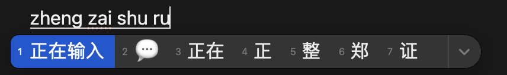

## compositionstart 和 compositionend

`input` 和 `textarea` 在监听 `onInput` 事件时，比如拼音在拼写时，并非实际输入。



如上图所示的状态时，同样也会触发 `Input` 事件。

此时 `compositionstart` 和 `compositionend` 字段可以控制此事件。

需要创建一个参数记录现在的状态：

```javascript
const composing = ref('')

function onCompositionStart() {
  composing.value = true
}

function onCompositionEnd(event: CompositionEvent) {
  composing.value = false
  onInput(event)
}
```

在实际的 template 中：

```html
<input
  @compositionstart="onCompositionstart"
  @compositionend="onCompositionend"
/>

<textarea
  @compositionstart="onCompositionstart"
  @compositionend="onCompositionend"
></textarea>
```

即在 `Input` 事件中只需要等到为 `false` 时处理对应的输入内容即可。

## inputRef 与光标位置控制

在实现 `input` 和 `textarea` 组件时，如果进行截断或格式化输入内容时，光标往往在格式化后或截断后放到了末尾。

为了保持光标位置不变，此处需要额外处理对应光标的位置。

有两处逻辑：

### 1. limitDiffLen

计算方式为：原始值长度 − 截断后值长度。用户在中间输入后进行截断，那么删除的实际是新输入的值。

```typescript
limitValueLength(value: string): string {
  const { maxlength } = this

  // 1. 如果未超出限制，直接返回
  if (maxlength !== undefined && this.getStringLength(value) > +maxlength) {

    // 2. 如果当前值已经是最大长度，返回当前值（防止重复处理）
    const modelValue = this.currentValue
    if (modelValue && this.getStringLength(modelValue) === +maxlength) {
      return modelValue
    }

    // 3. 聚焦状态：从光标位置智能删除超出字符
    const selectionEnd = inputRef?.selectionEnd
    if (this.focused && selectionEnd) {
      const valueArr = [...value]
      const exceededLength = valueArr.length - +maxlength  // 超出的字符数
      valueArr.splice(selectionEnd - exceededLength, exceededLength)  // 从光标前删除
      return valueArr.join('')
    }

    // 4. 非聚焦状态：简单从末尾截断
    return this.cutString(value, +maxlength)
  }
  return value
}
```

**场景**：`maxlength=5`，当前值是 `"abcde"`，光标在位置 3，用户输入 `"xy"`。

```
原始值: "abcde" (长度 5，已满)
用户在位置 3 插入 "xy"
输入后: "abcxyde" (长度 7)
selectionEnd = 5 (光标在 y 后面)

exceededLength = 7 - 5 = 2
splice(5 - 2, 2) → splice(3, 2)

数组: [a, b, c, x, y, d, e]
索引:  0  1  2  3  4  5  6
删除索引 3 开始的 2 个: 删除 x, y
结果: "abcde"
```

所以 `limitDiffLen = 7 - 5 = 2`，本质是：**当用户在中间位置输入导致超出时，从光标前面删除超出的部分**。

### 2. 光标位置调整

```javascript
if (limitDiffLen) {
  selectionStart -= limitDiffLen  // 5 - 2 = 3
  selectionEnd -= limitDiffLen    // 5 - 2 = 3
}
```

光标从位置 5 移到位置 3，回到原来的位置，因为新输入的字符被删除了。
