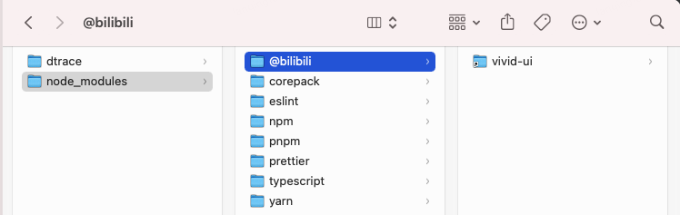
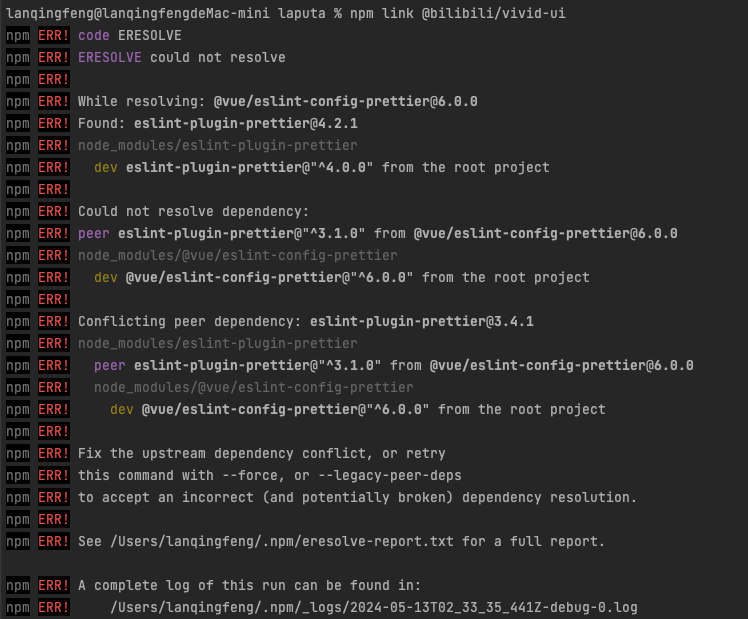

在本地调试 `npm` 包时，让包运行在另一个实际项目下进行调试，此时可以使用 `npm link`。

## 第一步

在包项目所在的文件夹内执行 `npm link` 命令。

此命令将在全局文件 `{prefix}/lib/node_modules/` 内，创建一个符号链接，这个链接指向 `npm link` 命令执行的地方。

执行 `npm link` 命令，结果如下：

## 第二步

到引入此包的另一个项目下执行 `npm link packageName` 命令，将会创建一个从全局安装的 `packageName` 到当前文件内的 `node_modules` 下的符号链接。

此处的 `packageName` 对应 `package.json` 中的 `name` 字段，而不是文件夹名称。

执行 `npm link packageName` 命令，结果如下：

此问题是 `peerDependencies` 引起的包冲突问题，有两种解决办法：

- `--force`：此命令会无视冲突，并强制获取远端 npm 库资源，即使本地有资源也会覆盖掉。
- `--legacy-peer-deps`：安装时忽略所有 `peerDependencies`，忽视依赖冲突，采用 `npm 4 到 6` 的方式去安装依赖，已有的依赖不会覆盖掉。
