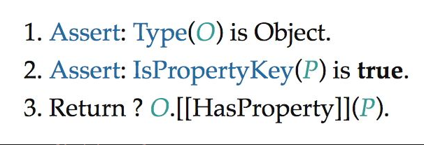
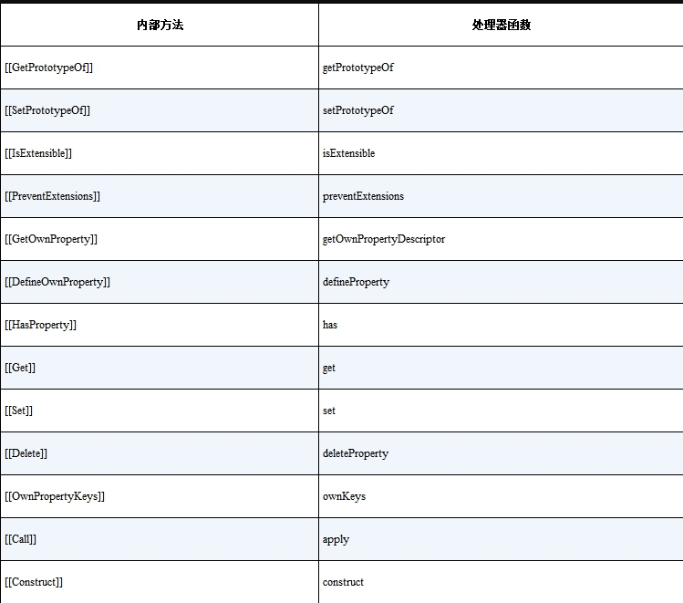

`Proxy` 是代理对象，能够实现对其他对象的代理，也就是说，`Proxy` 只能代理对象，无法代理非对象值，如字符串、布尔值等。

可以用 `Proxy` 来拦截函数的调用操作，使用 `apply` 拦截：

```javascript
const p2 = new Proxy(fn, {
  // 使用 apply 拦截函数调用
  apply(target, thisArg, argArray) {
    target.call(thisArg, ...argArray)
  }
})
```

`Reflect` 是一个全局对象。

在之前的响应式实现中，`effect` 中直接使用的 `target[key]` 来访问对象属性：

```javascript
const p = new Proxy(obj, {
  get(target, key) {
    track(target, key)
    return target[key]
  },
  set(target, key, newValue) {
    target[key] = newValue
    trigger(target, key)
  }
})
```

如果我们修改代理 `p` 属性 `foo` 的值时，**不会产生响应式变化**。

原因是，此时 `target[key]` 是原始对象 `obj`，`key` 是字符串 `'foo'`，所以 `target[key]` 等于直接访问 `obj.foo`。直接操作的原始对象，因此在副作用函数中建立的响应联系只针对原始对象，而不会触发代理 `p` 的追踪逻辑。

解决方案为利用 `Reflect` 来解决：

```javascript
const p = new Proxy(obj, {
  // 拦截读取操作，接收第三个参数 receiver
  get(target, key, receiver) {
    track(target, key)
    // 使用 Reflect.get 返回读取到的属性值
    return Reflect.get(target, key, receiver)
  }
})
```

## 如何拦截 Object

拦截 `for...in`，查询 ECMA 规范可以知道：



通过调用了对象内部的 `HasProperty` 得到，对应的拦截函数应该为 `has`，因此可以通过 `has` 拦截函数实现对 `in` 操作符的代理：

```javascript
const obj = { foo: 1 }
const p = new Proxy(obj, {
  has(target, key) {
    track(target, key)
    return Reflect.has(target, key)
  }
})
```

所有能拦截的方法：


