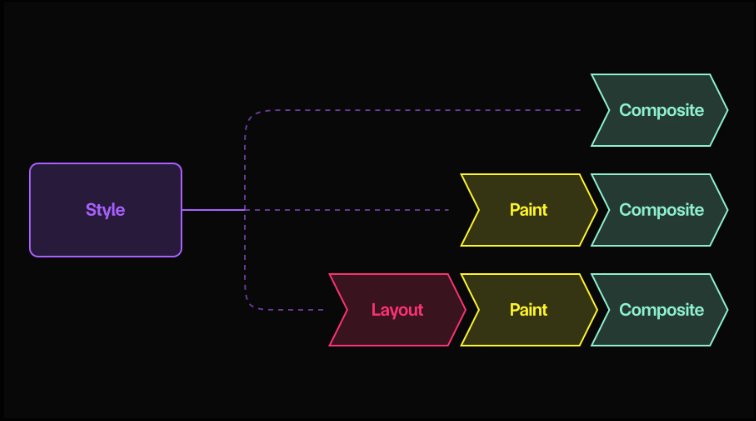

参考：[Web Animation Performance Tier List - Motion Magazine](https://motion.dev/magazine/web-animation-performance-tier-list)

## 浏览器渲染流程

主流浏览器分为三个步骤进行渲染：

1. Layout（布局）：计算所有元素的几何形状。主要计算 `width`、`position`、`display` 等规则
2. Paint（绘制）：决定哪些元素应分组到图层中并绘制它们的像素。更改 `background-color` 和 `color` 等数值触发绘制
3. Composite（合成）：将这些独立的图像合并在一起。可以使用 transform 和 filter 等触发合成图层而不触发绘制。

关键是触发每一个步骤会触发后续的每一步。就是，如果你触发了布局，你还需要绘制和合成。而如果你触发了合成，就不需要重新运行其他步骤。



除此之外，你需要知道这些步骤大多数都是同步（synchronously）进行的，即在主线程上依次进行。大部分的 JS 任务和其他浏览器工作都在这里完成。

因此，如果主线程很忙，那么渲染管线就会被阻止更新屏幕，就表现为卡顿动画。

此外，还有一个 `compositor thread`（合成线程）。如果更改样式只触发合成步骤，那么通常可以在合成线程上单独运行动画本身。这种情况下不会被主线程的阻塞所影响。

## 任务分级

我们在了解了浏览器基本的绘制原理后，我们就可以对动画技术进行分级。

- S 级：完全可以在合成（composite）线程上运行的动画。
- A 级：运行在主线程上，但触发合成器。
- B 级：需要做一些 DOM 的设置测量，然后以 A 级或 S 级动画形式运行。
- C 级：触发 Paint（绘制）
- D 级：触发 Layout（布局）
- F 级

## S 级

S 级动画可以完全运行在合成线程上。

## Compositor Styles

通常可以通过合成器动画的样式有 `transform`、`opacity`、`filter` 和 `clip-path`

用 `CSS`、`Web Animation API` 或支持 `WAAPI` 的动画库来动画化这些值，可以确保主线程很忙的情况下，动画也能保持流畅运行。

```javascript
animate(".box", { opacity: 1 })
```

相比之下，基于 `requestAnimationFrame` 的 `JS`，仍然可以更新这些属性，但动画本身运行在主线程上，这意味着动画是可中断的——通长流畅，但主线程被阻塞时容易卡顿。

## Avoid style recalculations（避免样式重新计算）

硬件加速动画的另一个关键优势是元素的视觉效果可以更新而无需重新计算样式。

样式计算本身的消耗非常昂贵，尤其是在复杂的 DOM 结构中，或者使用慢速 CSS 选择器（[Reduce the scope and complexity of style calculations](https://web.dev/articles/reduce-the-scope-and-complexity-of-style-calculations)）的页面。

## Scroll Animation（滚动动画）

当使用 `Scroll Timeline` 或者 `View Timeline` 来动画合成这些合成器值时，无论是 `CSS`、`WAAPI` 还是 `scroll()` 函数，这些滚动动画也会被硬件加速

同时，滚动本身运行在合成线程上。

这意味着如果你通过读取 `scrollTop` 来运行滚动动画，那么你的动画可能比滚动晚一帧更新，甚至帧率完全不同。这类滚动动画属于 D 级。

推荐使用 `position: sticky` 或 `fixed` 来同步元素位置以滚动的主要原因，而不是更新 `transform`。

## De-optimisation

合成器动画线程的功能可能不是完全的。因为如果用户请求合成线程不支持的功能，浏览器可以直接在主线程上运行，从而失去硬件加速。

Safari 最大的问题，它还没有专用的合成引擎，而是重复使用 macOS 的核心动画框架。如果你的动画需要 Core Animation 不支持的功能如 `playbackRate` 播放速率，超过 1，那么动画就不再是硬件加速了。

同样某些数值可能不被合成引擎支持，如在 chrome 添加加速动画后，才支持基于 `%` 和 `translate` 值。

## Layer Size（层级尺寸）

S 级动画的另一个大的性能限制就是，它们总是需要创建一个图层。

图层是元素或者元素组，被绘制在一起。本质上合成可以独立移动、变换和淡出。然后将他们全部组合成最终图像。

`filter: blur()` 是硬件加速的。但这并不意味着他是没有成本的。模糊效果的成本会随着每个像素模糊半径的增加和更大层级的增加而急剧上升。模糊本身会使得层级变大。进一步消耗内存。

## A-Tier（A 级）

A 级动画会改变合成值（如 `transform` 或 `opacity`），但它是由主线程驱动的。改变这些值仅会触发合成，这意味着在理想情况下动画会表现优异，但可能会被其他主线程工作中断。

## Layers only

如果要样式单独触发合成，被设置该样式的元素必须先被提升为层级。如果不是这样的话，会和 `transform` 和 `opacity` 等值一样触发绘制。

最终，浏览器决定哪些元素会成为层级。原因因浏览器而异，他们数量众多且神秘，包括：

- An associated CSS/WAAPI transform animation
- A 3D transform
- position: fixed or sticky
- backdrop-filter

你也可以使用 `will-change` 提示元素应该变为涂层

MDN 文档警告（用一个大大的红色框）指出 `will-change` 应该谨慎使用。核心问题是，通过创建太多层或太大的层，我们可能会耗尽 GPU 内存预算。

## JavaScript animations

一旦一个元素成为层，那么通过 `element.style` 更改合成值将只触发合成，跳过绘制。

```javascript
element.style.transform = "translateX(100px)"
```

这适用于所有经典的 JS 动画库，如 GSAP，或自定义的 `requestAnimationFrame` 实现。这也是 Motion 动画独立变换的方式：

```javascript
animate(element, { x: 100 })
```

当然，运行 JS 动画时会有额外的 CPU 开销（尽管这也适用于主线程 CSS/WAAPI 动画）。但根据我的经验，JS 运行时几乎不是导致动画缓慢的原因，几乎总是昂贵的渲染。

在某些情况下，比如动画化成千上万个小元素，基准测试显示 `requestAnimationFrame` 或 GSAP 的性能会优于硬件加速动画。

## Shaders 着色器

着色器更新仍然通过 `requestAnimationFrame` 进行调度，这意味着时间由主线程控制。这就是为什么着色器不是 S-Tier：它们可以渲染得非常快，但如果主线程被阻塞，仍然可能会错过帧。

## IntersectionObserver

`IntersectionObserver` 是检测元素进入或离开视口的最高效方式。它是 Motion 的 [`inView`](https://motion.dev/docs/inview) 功能和 [`whileInView`](https://motion.dev/docs/react-scroll-animations) 属性背后的秘密武器。

一个观察者在一个后台线程中有效地跟踪元素相对于视口的可见性，而没有任何 `scrollTop` 读取或其他 DOM 测量。因此，它对主线程的工作量影响极小。

因为它非常轻量级，所以非常适合用于滚动触发的动画：

```javascript
inView(element, () => {
  animate(element, { x: -100 })
})
```

```jsx
<motion.div whileInView={{ opacity: 1 }} />
```

但 `IntersectionObserver` 还有一个常被忽视的超级能力：关闭屏幕外的动画。

想象我们有一个长时间运行的动画，它通常会在页面打开时一直播放：

```css
.in-view {
  animation: spin 2s infinite;
}
```

通过使用 `IntersectionObserver`，我们可以确保这个动画只有在元素本身位于可见区域内时才会播放：

```javascript
inView(element, () => {
  element.classList.add("in-view")

  return () => element.classList.remove("in-view")
})
```

```css
.in-view {
  animation: spin 2s infinite;
}
```
