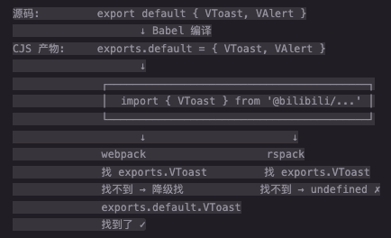

## sakura 的导入

在旧仓库中 sakura 的组件导出为：

```javascript
export default { VToast, VAlert, ... }
```

而不是具名导出。

Webpack 的模块互操作会自动处理这种情况，允许：

```javascript
import { VToast } from '....'
```

从 `default export` 中解构，但 rspack 更加严格。

需要修改为：

```javascript
import Sakura from '...'
const { VToast, VAlert } = Sakura
```

原理：webpack 在实际运行过程中需要将 ESM（ES Module）转换为 CJS（Common JS）规范来运行。

但是这两套是不同的模块规范，webpack 做了大量的魔法让他们互相兼容，而 rspack 在某些场景下更贴近标准行为。

导出方式：

CJS

```javascript
module.exports = { VToast, VAlert }
```

ESM

```javascript
// 具名导出 - 每个 export 就是独立的绑定
export const VToast = () => {}
export const VAlert = () => {}

// 默认导出
export default { VToast, VAlert }
```

关键区别在于：ESM 的 `export default obj` 不等于把 `obj` 的属性变成具名导出。`default` 本身就是唯一的导出名。

Babel 将 ESM 的导出转换为 CJS 为：

```javascript
// 源码
export default { VToast, VAlert }

// Babel 编译后的 CJS
Object.defineProperty(exports, "__esModule", { value: true });
exports.default = { VToast, VAlert };
```

- `exports.__esModule = true`：这是一个**标记**，告诉打包工具"这个 CJS 模块是从 ESM 编译来的"。
- `exports.default = { ... }`：默认导出挂在 `.default` 属性上。
- **没有** `exports.VToast`：因为源码里就没有具名导出。

## Webpack 的互操作"魔法"

当你在 webpack 中写 `import { VToast } from '@bilibili/sakura'`，webpack 生成的运行时大致是：

```javascript
function __webpack_require__(moduleId) {
  var module = { exports: {} };
  // 执行模块代码，填充 module.exports
  modules[moduleId](module, module.exports, __webpack_require__);
  return module.exports;
}

// 当 ESM 代码 import 一个 CJS 模块时
function getDefaultExport(module) {
  if (module.__esModule) {
    // 有 __esModule 标记，说明是 Babel 编译的
    // webpack 会直接返回整个 exports 对象
    return module;
  }
  // 否则包装一下
  return { default: module };
}
```

关键在于：webpack 看到 `__esModule` 标记后，会把**整个 `exports` 对象**当作模块的命名空间对象（namespace object）。所以：

```javascript
import { VToast } from '@bilibili/sakura'

// webpack 实际执行的是：
var _sakura = __webpack_require__('@bilibili/sakura')
// _sakura = { __esModule: true, default: { VToast, VAlert } }

var VToast = _sakura.VToast  // ← 尝试从 exports 上取
```

这一步 `_sakura.VToast` 本应是 `undefined`（因为只有 `_sakura.default.VToast`），**但 webpack 在某些版本/配置下会进一步做"降级兼容"**：当检测到 `import { X }` 无法从 namespace 上直接取到时，会尝试从 `.default` 上查找。这就是 webpack 的互操作魔法。

rspack 对模块互操作的实现更接近规范行为：

```javascript
exports = { __esModule: true, default: { VToast, VAlert } }

import { VToast } from '...'
→ 在 exports 上找 VToast
→ exports.VToast === undefined
→ TypeError: VToast is not a function
```

步骤对比：



## exports 字段的严格程度差异

### 1. `package.json` 中的 `exports` 字段

`@bilibili/http-svc` 的 `package.json` 中定义了：

```json
{
  "main": "dist/http-service.js",
  "exports": {
    ".": {
      "require": "./dist/http-service.js",
      "import": "./dist/http-service.esm.js"
    },
    "./polyfill": {
      "require": "./dist/polyfill.js",
      "import": "./dist/polyfill.js"
    }
  }
}
```

`exports` 是 Node.js 12.11+ 引入的**包封装（Package Encapsulation）机制**。一旦 `package.json` 中声明了 `exports` 字段，它就成为该包对外的唯一入口白名单——只有在 `exports` 中声明的路径才允许被外部访问。

在这个包中，合法的导入路径只有两个：

- `@bilibili/http-svc` → 命中 `"."`
- `@bilibili/http-svc/polyfill` → 命中 `"./polyfill"`

`@bilibili/http-svc/dist/polyfill` **不在白名单内**，尽管 `dist/polyfill.js` 这个文件确实存在于磁盘上。

### 2. Webpack 如何处理 `exports`

Webpack 4 完全不支持 `exports` 字段，Webpack 5 虽然支持但实现较宽松：

```
解析 @bilibili/http-svc/dist/polyfill

步骤 1: 检查 exports 字段
        → "./dist/polyfill" 未匹配任何 exports 条目

步骤 2: 回退（fallback）
        → 忽略 exports 约束
        → 直接按文件路径查找 node_modules/@bilibili/http-svc/dist/polyfill.js
        → 文件存在，解析成功 ✓
```

Webpack 在 `exports` 匹配失败时会**静默回退**到传统的文件路径解析（即 `main` / 直接路径查找），这是一种兼容性策略——因为大量旧代码依赖直接访问包内文件。

### 3. Rspack 如何处理 `exports`

Rspack 遵循 Node.js 的严格语义（与 Node.js `--experimental-modules` 和现代工具链一致）：

```
解析 @bilibili/http-svc/dist/polyfill

步骤 1: 检查 package.json 是否有 exports 字段
        → 有

步骤 2: exports 存在，进入严格模式
        → 所有子路径必须通过 exports 映射解析
        → "./dist/polyfill" 未匹配任何条目

步骤 3: 没有 fallback，直接报错
        → Package subpath './dist/polyfill' is not defined by "exports" ✗
```

关键区别在于：一旦 `exports` 字段存在，rspack 就**不再允许**通过文件路径直接访问包内部文件。`exports` 被当作一个硬性的访问控制边界。

### 为什么 rspack 选择严格模式

`exports` 的设计意图就是**封装包的内部实现**。包作者通过 `exports` 明确告诉消费者："你只能用这些路径，内部文件结构可能随时变化。"

- `./polyfill` 是包作者承诺的**公开 API**。
- `./dist/polyfill` 是**内部实现路径**，包作者随时可能改成 `./lib/polyfill.js` 或其他路径。

rspack（以及 Node.js 原生 ESM、Vite、esbuild 等现代工具）选择严格遵守这个契约，而 webpack 出于历史兼容性做了妥协。

所以正确做法是用包作者声明的公开路径 `@bilibili/http-svc/polyfill`，而不是直接指向内部文件。
