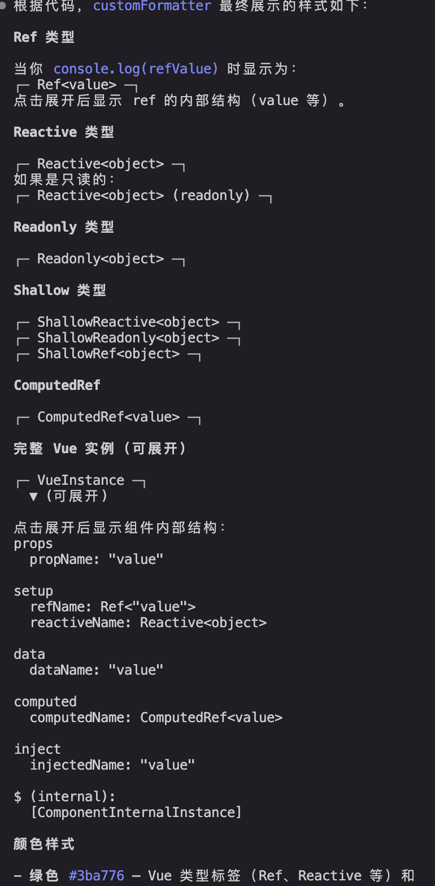

## 1. 使用 Rollup.js 进行项目构建

### 1.1 插件配置与 `__DEV__`

`vue3` 使用 `rollup.js` 对项目进行构建，`__DEV__` 常量通过插件配置来预定义。其功能类似于 `webpack` 中的 `DefinePlugin` 插件。

例如在开发环境下，我们会通过该常量来决定是否初始化自定义 `Formatter`：`initCustomFormatter` 专门用于在开发环境下增强控制台输出的调试信息。



### 1.2 Tree-Shaking 与 `/*#__PURE__*/` 注释

`Rollup` 能够识别 `/*#__PURE__*/` 注释。它告诉打包工具：该函数调用不会产生副作用，可以安全地进行 Tree-Shaking。

```javascript
import { foo } from './utils'

/*#__PURE__*/ foo()
```

若 `foo()` 未被后续使用，构建出的 `bundle.js` 将是空的。此注释不仅被 Rollup 识别，Webpack 及压缩工具（如 Terser）也同样支持。

## 2. 模块输出格式

### 2.1 IIFE 格式（立即执行函数）

适用于直接在浏览器中通过 `script` 标签引用的场景。

`Rollup` 配置示例：

```javascript
// rollup.config.js
export default {
  input: 'input.js',
  output: {
    file: 'output.js',
    format: 'iife' // 指定模块形式为立即执行函数
  }
}
```

浏览器引用：

```html
<body>
  <script src="/path/to/vue.js"></script>
  <script>
    const { createApp } = Vue
    // ...
  </script>
</body>
```

### 2.2 ESM 格式

`Vue.js` 提供了多种 `ESM` 资源以适应不同环境：

1. **浏览器原生支持**：使用带有 `-browser` 字样的资源（如：`vue.esm-browser.js`），直接给 `<script type="module">` 使用。
2. **构建工具支持**：使用带有 `-bundler` 字样的资源（如：`vue.runtime.esm-bundler.js`），给 `Rollup` 或 `Webpack` 使用。

**关键区别**：

- 浏览器环境：`__DEV__` 会根据开发/生产环境被硬编码为 `true` 或 `false`。
- 构建工具环境：不直接使用 `true`/`false`，而是使用 `(process.env.NODE_ENV !== 'production')`。

## 3. 核心概念

### 3.1 渲染器（Renderer）

渲染器负责将虚拟 DOM（vnode）转换为真实 DOM 并挂载到容器上：

```javascript
function renderer(vnode, container) {
  // 使用 vnode.tag 作为标签名称创建 DOM 元素
  const el = document.createElement(vnode.tag)
  // 遍历 vnode.props，将属性、事件添加到 DOM 元素
  for (const key in vnode.props) {
    if (/^on/.test(key)) {
      // 如果 key 以 on 开头，说明它是事件
      el.addEventListener(
        key.substr(2).toLowerCase(), // 事件名称 onClick ---> click
        vnode.props[key]             // 事件处理函数
      )
    }
  }

  // 处理 children
  if (typeof vnode.children === 'string') {
    // 如果 children 是字符串，说明它是元素的文本子节点
    el.appendChild(document.createTextNode(vnode.children))
  } else if (Array.isArray(vnode.children)) {
    // 递归地调用 renderer 函数渲染子节点，使用当前元素 el 作为挂载点
    vnode.children.forEach(child => renderer(child, el))
  }

  // 将元素添加到挂载点下
  container.appendChild(el)
}
```

`renderer` 函数接收两个参数：

- `vnode`：虚拟 DOM 对象。
- `container`：一个真实 DOM 元素，作为挂载点，渲染器会把虚拟 DOM 渲染到该挂载点下。

### 3.2 编译器

编译器负责将模板字符串转换成虚拟 DOM 渲染函数（Render Function）。

## 4. 响应式系统

### 4.1 技术演进

- **Vue 2**：采用 `Object.defineProperty` 实现，存在无法检测属性新增/删除等局限。
- **Vue 3**：采用 ES2015+ 的 `Proxy` 对象实现，提供了更全面的拦截能力。

### 4.2 基础响应式实现

利用 `Proxy` 的 `get` 和 `set` 拦截器来收集和触发副作用函数：

```javascript
// 存储副作用函数的桶
const bucket = new Set()

// 原始数据
const data = { text: 'hello world' }
// 对原始数据的代理
const obj = new Proxy(data, {
  // 拦截读取操作
  get(target, key) {
    // 将副作用函数 effect 添加到存储副作用函数的桶中
    bucket.add(effect)
    // 返回属性值
    return target[key]
  },
  // 拦截设置操作
  set(target, key, newVal) {
    // 设置属性值
    target[key] = newVal
    // 把副作用函数从桶里取出并执行
    bucket.forEach(fn => fn())
    // 返回 true 代表设置操作成功
    return true
  }
})
```

### 4.3 健壮的响应式系统实现

为了建立"目标对象 → 属性 → 副作用函数"的精确对应关系，需要使用更复杂的数据结构（`WeakMap → Map → Set`）：

```javascript
const obj = new Proxy(data, {
  // 拦截读取操作
  get(target, key) {
    // 将副作用函数 activeEffect 添加到存储副作用函数的桶中
    track(target, key)
    return target[key]
  },
  // 拦截设置操作
  set(target, key, newVal) {
    target[key] = newVal
    // 把副作用函数从桶里取出并执行
    trigger(target, key)
  }
})

// 在 get 拦截函数内调用 track 函数追踪变化
function track(target, key) {
  if (!activeEffect) return
  let depsMap = bucket.get(target)
  if (!depsMap) {
    bucket.set(target, (depsMap = new Map()))
  }
  let deps = depsMap.get(key)
  if (!deps) {
    depsMap.set(key, (deps = new Set()))
  }
  deps.add(activeEffect)
}

// 在 set 拦截函数内调用 trigger 函数触发变化
function trigger(target, key) {
  const depsMap = bucket.get(target)
  if (!depsMap) return
  const effects = depsMap.get(key)
  effects && effects.forEach(fn => fn())
}
```

### 4.4 完整响应式实现原理

实现了 vue 的依赖收集、副作用清理、嵌套处理、避免死循环以及异步调度的基础功能：

```javascript
// 1. 存储副作用函数的"桶"
// 结构为：WeakMap<target, Map<key, Set<effectFn>>>
const bucket = new WeakMap()

// 2. 当前激活的副作用函数，以及解决嵌套问题的栈
let activeEffect
const effectStack = []

/**
 * 核心 effect 函数
 * @param {Function} fn 副作用函数
 * @param {Object} options 调度选项等
 */
function effect(fn, options = {}) {
  const effectFn = () => {
    // 调用 cleanup 清除旧的依赖关系，防止遗留副作用
    cleanup(effectFn)

    // 当调用 effectFn 时，将其设置为当前激活的副作用函数
    activeEffect = effectFn
    // 入栈，处理嵌套 effect
    effectStack.push(effectFn)

    // 执行真正的副作用逻辑，并记录返回值
    const res = fn()
    // 执行完后出栈，并将 activeEffect 指向栈顶元素
    effectStack.pop()
    activeEffect = effectStack[effectStack.length - 1]

    return res
  }

  // 将 options 挂载到 effectFn 上
  effectFn.options = options
  // deps 用来存储所有包含当前副作用函数的依赖集合（Set）
  effectFn.deps = []

  // 如果是非 lazy 的，则立即执行
  if (!options.lazy) {
    effectFn()
  }
  return effectFn
}

/**
 * 清除依赖
 */
function cleanup(effectFn) {
  for (let i = 0; i < effectFn.deps.length; i++) {
    const deps = effectFn.deps[i]
    deps.delete(effectFn)
  }
  effectFn.deps.length = 0
}

/**
 * 追踪变化（在 Proxy 的 get 中调用）
 */
function track(target, key) {
  if (!activeEffect) return
  let depsMap = bucket.get(target)
  if (!depsMap) {
    bucket.set(target, (depsMap = new Map()))
  }

  let deps = depsMap.get(key)
  if (!deps) {
    depsMap.set(key, (deps = new Set()))
  }

  // 互相引用，方便 cleanup
  deps.add(activeEffect)
  activeEffect.deps.push(deps)
}

/**
 * 触发变化（在 Proxy 的 set 中调用）
 */
function trigger(target, key) {
  const depsMap = bucket.get(target)
  if (!depsMap) return

  const effects = depsMap.get(key)

  // 解决 Set 在迭代时删除又添加导致的无限循环问题
  const effectsToRun = new Set()
  if (effects) {
    effects.forEach(effectFn => {
      // 避免当前正在执行的副作用函数被重复触发（防止 obj.foo++ 导致的死循环）
      if (effectFn !== activeEffect) {
        effectsToRun.add(effectFn)
      }
    })
  }

  effectsToRun.forEach(effectFn => {
    // 如果存在调度器，则调用调度器，否则直接执行
    if (effectFn.options.scheduler) {
      effectFn.options.scheduler(effectFn)
    } else {
      effectFn()
    }
  })
}

/**
 * 定义响应式对象
 */
function reactive(data) {
  return new Proxy(data, {
    get(target, key) {
      track(target, key)
      return target[key]
    },
    set(target, key, newVal) {
      target[key] = newVal
      trigger(target, key)
      return true
    }
  })
}
```

**关键点解析**：

- **WeakMap 的使用**：使用 `WeakMap` 而不是 `Map` 作为桶的顶层结构。原因在于 `WeakMap` 对 `target` 是弱引用。一旦对象在外部不再被引用，垃圾回收机制会自动将其从桶中清理掉，防止内存泄漏。
- **Cleanup 清除机制**：这是处理"三元表达式"或动态依赖的关键。如果代码中有 `obj.ok ? obj.text : 'not'`，当 `ok` 变为 `false` 后，`text` 的修改不应该触发副作用。`cleanup` 确保每次执行前断开旧连接，重新建立新连接。
- **副作用函数栈 (Effect Stack)**：在 Vue 组件中，经常会有组件嵌套的情况（即 effect 嵌套）。通过维护一个栈，确保 `activeEffect` 始终指向当前正在运行的那个 effect，防止内层 effect 执行完后外层的 `activeEffect` 丢失。
- **防止无限递归**：如果在 effect 内部执行 `obj.foo++`，这会同时触发 `get` 和 `set`。在 `trigger` 中判断 `effectFn !== activeEffect`，如果是同一个，则跳过执行，避免死循环。
