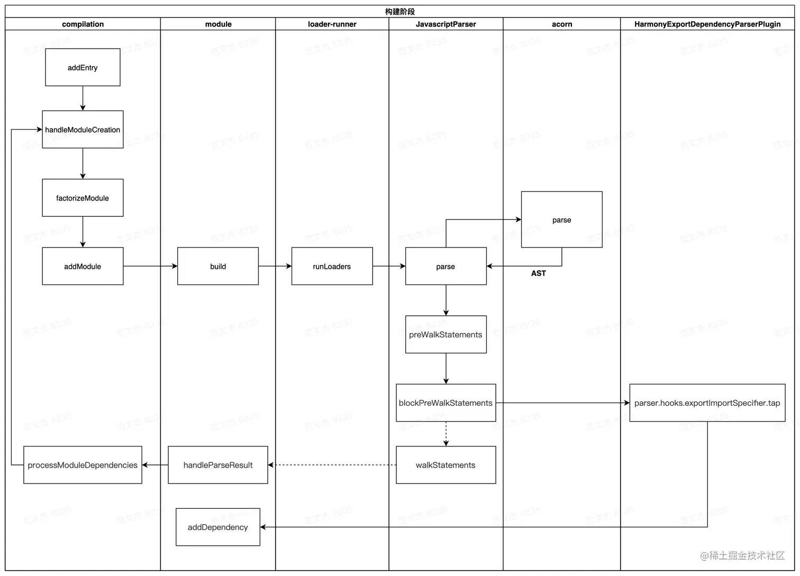
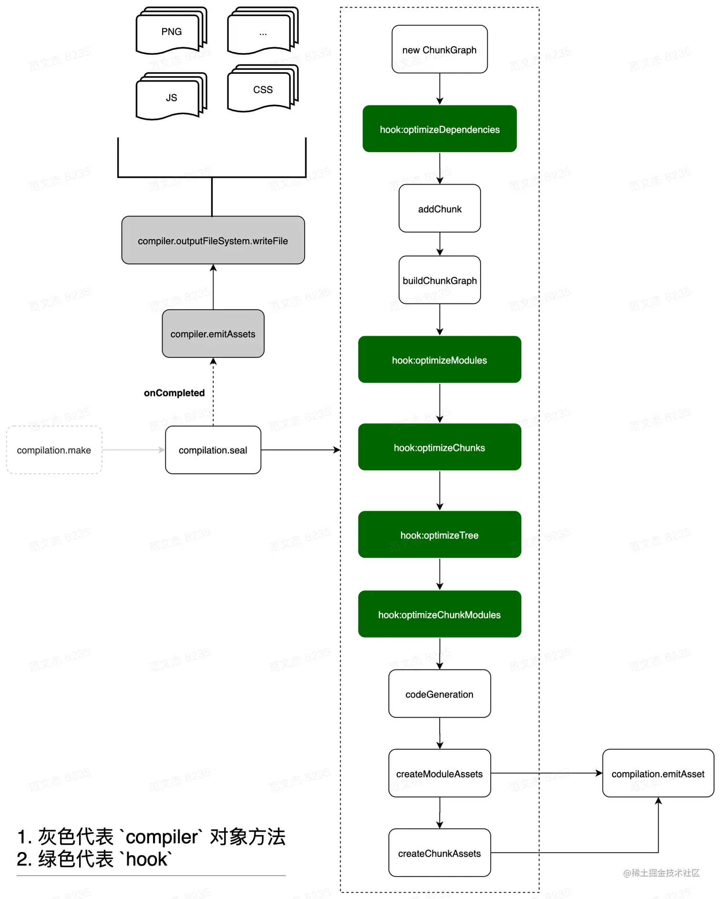

> 参考：[掘金 - Webpack 详解](https://juejin.cn/post/6949040393165996040)

## loader 和 plugin 的区别

### Loader

`Loader` 本质上是一个函数，负责代码的转译，对接收到的内容进行转换后将转换后的结果返回，配置 `Loader` 通过在 `modules.rules` 中以数组的形式配置。

### Plugin

`Plugin` 本质是一个带有 `apply(compiler)` 的函数可以处理 `JS` 代码，基于 `tapable` 事件流框架来监听 `webpack` 构建/打包过程中发布的 `Hooks` 来通过自定义的逻辑和功能改变输出结果。`Plugins` 通过 `plugins` 以数组的形式配置。

### 总结

**Loader** 主要负责将代码转译为 **webpack** 可以处理的 JavaScript 代码，而 **Plugin** 更多的是负责通过接入 **webpack** 构建过程来影响构建过程以及产物的输出，**Loader** 的职责相对比较**单一**简单，而 **Plugin** 更为丰富多样。

## 如何保证众多 Loader 按照想要的顺序执行？

可以通过 `enforce` 来强制控制 Loader 的执行顺序（`pre` 表示在所有正常的 loader 执行之前执行，`post` 则表示在之后执行）。

> Loader 的执行有以下两个阶段：
>
> 1. **Pitching** 阶段：loader 上的 pitch 方法，按照 `后置(post)、行内(inline)、普通(normal)、前置(pre)` 的顺序调用。更多详细信息，请查看 [Pitching Loader](https://webpack.docschina.org/api/loaders/#pitching-loader)。
> 2. **Normal** 阶段：loader 上的常规方法，按照 `前置(pre)、普通(normal)、行内(inline)、后置(post)` 的顺序调用。模块源码的转换，发生在这个阶段。

## 如何编写 Loader

### loader 的特性

- loader 支持链式调用，上一个 loader 的执行结果会作为下一个 loader 的入参。
  - 根据这个特性，我们知道我们的 **loader** 想要有返回值，并且这个返回值必须是标准的 JavaScript 字符串或者 `AST` 代码结构，这样才能保证下一个 **loader** 的正常调用。
- loader 的主要职责就是将代码转译为 **webpack** 可以理解的 js 代码。
  - 根据这个特性，loader 内部一般需要通过 `return / this.callback` 来返回转换后的结果。
- 单个 loader 一般只负责单一的功能。
  - 根据这个特性，我们的 loader 应该符合**单一职责**的原则，尽量别让单个 loader 执行太多职责。
- 善于利用开发工具
  - **loader-utils**：[loader-utils](https://github.com/webpack/loader-utils) 是一个非常重要的 Loader 开发辅助工具，为开发中提供了诸如读取配置、`requestString` 的序列化和反序列化、`getOptions/getCurrentRequest/parseQuery` 等核心接口……等等功能，对于 loader 的开发十分有用。
  - **schema-utils**：[schema-utils](https://www.npmjs.com/package/schema-utils) 是用于校验用户传入 loader 的参数配置的校验工具，也是在开发中十分有用。
- loader 是无状态的
  - 根据此特性，我们不应该在 loader 保存状态。
- webpack 默认缓存 loader 的执行结果
  - **webpack** 会默认**缓存** loader 的执行结果直到资源/所依赖的资源发生变化。如果想要 loader 不缓存可以通过 `this.cacheable` 显式声明不做缓存。
- Loader 接收三个参数
  - `source`：资源输入，对于第一个执行的 loader 为资源文件的内容，后续执行的 loader 则为前一个 loader 的执行结果，也可能是字符串或者是代码的 `AST` 结构。
  - `sourceMap`：可选参数，代码的 `sourcemap` 结构。
  - `data`：可选参数，其他需要在 `Loader` 链中传递的信息。
- 正确上报 loader 的异常信息
  - 一般尽量使用 `logger.error` 减少对用户的干扰。
  - 对于需要明确警示用户的错误，优先使用 `this.emitError`。
  - 对于已经严重到不能继续往下编译的错误，使用 `callback`。
- loader 函数中的 `this` 由 `webpack` 提供，并且指向了 `loader-runtime` 的 `loaderContext` 对象。
  - 可以通过 `this` 来获取 loader 需要的各种信息。**Loader Context** 提供了许多实用的接口，我们不仅可以通过这些接口获取需要的信息，还可以通过这些接口改变 webpack 的运行状态（相当于产生 **Side Effect**）。
- loader 由 `pitch` 和 `normal` 两个阶段
  - 根据此特性，我们可以在 `pitch` 阶段预处理一些操作。

## 如何编写 Plugin

`compiler` 对象是一个全局单例，代表了 webpack 从开启到关闭的整个生命周期，负责启动编译和监听文件，而 `compilation` 是每次构建过程的上下文对象，包含当次构建所需要的信息。

> 每次热更新和重新编译都会创建一个新的 `compilation` 对象，`compilation` 对象只代表当次编译。

- 插件是通过监听 webpack 发布的 hooks 来工作的
  - 根据这个特性，我们的 plugin 一定是一个函数或者一个包含 `apply()` 的对象，这样才可以监听 `compiler` 对象。
- 传递给插件的 `compiler` 和 `compilation` 都是同一个引用
  - 根据此特性，我们知道我们的插件是会影响到其他插件的，所以我们在编写插件的时候应该分析会对其他插件造成啥影响。
- 基于 **tapable** 来完成对 `hooks` 的复杂的订阅以及响应
  - 编译过程的特定节点会分发特定钩子，插件可以通过这些钩子来执行对应的操作。
  - 通过 **tapable** 的回调机制以参数形式传递上下文信息。
  - 可以通过上下文的众多接口来影响构建流程。
- 监听一些具有特定意义的 `hook` 来影响构建
  - `compiler.hooks.compilation`：**webpack** 刚启动完并创建 `compilation` 对象后触发。
  - `compiler.hooks.make`：**webpack** 开始构建时触发。
  - `compiler.hooks.done`：**webpack** 完成编译时触发，此时可以通过 `stats` 对象得知编译过程中的各种信息。

## 文件指纹

文件指纹是文件打包后的一连串后缀。

### 作用

- **版本管理**：在发布版本时，通过文件指纹来区分修改的文件和未修改的文件。
- **使用缓存**：浏览器通过文件指纹是否改变来决定使用缓存文件还是请求新文件。

### 种类

- `Hash`：和整个项目的构建相关，只要项目有修改（`compilation` 实例改变），`hash` 就会更新。
- `Contenthash`：和文件内容有关，只有内容发生变化才会修改。
- `Chunkhash`：和 `webpack` 构架的 chunk 有关，不同 `entry` 会构建出不同 chunk。

### 使用

- JS 文件：使用 `Chunkhash`
- CSS 文件：使用 `Contenthash`
- 图片等静态资源：使用 `hash`

## HMR 原理

使用 `webpack-dev-server`（WDS）托管静态资源，同时以 `Runtime` 方式注入 **HMR** 客户端代码。

浏览器加载页面后与 **WDS** 建立 `WebSocket` 连接。

**webpack** 监听到文件变化后，增量构建发生变更的模块，并通过 `WebSocket` 发送 **hash** 事件。

浏览器接收到 **hash** 事件后，请求 `manifest` 资源文件，确定增量变更范围。

浏览器加载发生变化的增量模块。

**webpack** 运行时触发变更模块的 `module.hot.accept` 回调，执行代码变更逻辑。

`done` 完成构建，更新变化。

**总结**就是 **webpack** 将静态资源托管在 **WDS** 上，而 **WDS** 又和浏览器通过 `webSocket` 建立联系，而当 **webpack** 监听到文件变化时，就会向浏览器推送更新并携带新的 `hash` 与之前的 `hash` 进行对比，浏览器接收到 `hash` 事件后变化加载变更的增量模块并触发变更模块的 `module.hot.accept` 回调执行变更逻辑。

> 参考：[掘金 - Webpack HMR 原理](https://juejin.cn/post/7021729340945596424)

## 构建流程

- **初始化参数**：从配置文件和 `Shell` 语句中读取与合并并计算出最终的参数。
- **开始编译**：用上一步得到的初始化参数初始化 `Compiler` 对象，加载所有配置的插件，执行 `compiler` 对象的 `run` 方法开始编译流程。
- **确定入口**：根据 `entry` 找出入口文件。
- **编译模块**：从入口文件开始，根据配置的 `loader` 对模块进行转译，如果该模块还有依赖的模块，则**递归**对这些模块进行翻译，通过递归上述操作直到对所有模块都进行转译。
- **完成模块编译**：在经过 `Loader` 翻译完所有模块后，得到了每个模块转译后的内容以及模块之间的依赖关系图（**ModuleGraph**）。
- **输出资源**：根据入口和模块之间的依赖关系生成一个个包含多个模块的 `Chunk`，再把每个 `Chunk` 转换成一个单独的文件加入到输出列表中。
- **输出完成**：根据输出项的配置，将文件内容写到文件系统。

### 从资源转换角度看

- `compiler.make` 阶段
  - `entry` 文件以 `dependence` 对象形式加入 `compilation` 的依赖列表，`dependence` 对象记录了 `entry` 的相关信息。
  - 根据 `dependency` 创建对应的 `module` 对象，之后读入 `module` 对应的文件内容，调用 `loader-runner` 对内容做转化，转化结果若有对其他依赖则继续读入依赖资源，重复此过程直到所有的依赖均被转换为 `module`。
- `compilation.seal` 阶段
  - 遍历 `module` 集合，根据 `entry` 配置以及引入资源的方式，将 `module` 分配到不同的 `Chunk`。
  - `Chunk` 之间最终形成 `ChunkGraph` 结构。
  - 遍历 `ChunkGraph` 调用 `compilation.emitAssets` 方法标记 `chunk` 的输出规则，及转换为 `assets` 集合。
- `compiler.emitAssets` 阶段
  - 将 `assets` 写入文件系统。

## 构建流程详细步骤

### 初始化阶段

将 `process.args + webpack.config.js` 合并成用户配置。

调用 `validateSchema` 校验配置。

调用 `getNormalizedWebpackOptions` + `applyWebpackOptionsBaseDefaults` 合并出最终配置。

创建出 `compiler` 对象。

遍历用户定义的 `plugins` 集合，执行插件的 `apply` 方法。

调用 `new WebpackOptionsApply().process` 方法，加载各种内置插件，此处的内容并不需要手动配置，会在初始化阶段根据配置内容动态注入对应的插件。

到此，`compiler` 实例被创建出来了，相应的环境参数也预设好了，紧接着开始调用 `compiler.compile` 函数。

从创建 `compiler` 实例到调用 `make` 钩子，逻辑链路很长：

- 启动 webpack，触发 `lib/webpack.js` 文件中 `createCompiler` 方法。
- `createCompiler` 方法内部调用 `WebpackOptionsApply` 插件。
- `WebpackOptionsApply` 定义在 `lib/WebpackOptionsApply.js` 文件，内部根据 `entry` 配置决定注入 `entry` 相关的插件，包括：`DllEntryPlugin`、`DynamicEntryPlugin`、`EntryPlugin`、`PrefetchPlugin`、`ProgressPlugin`、`ContainerPlugin`。
- `Entry` 相关插件，如 `lib/EntryPlugin.js` 的 `EntryPlugin` 监听 `compiler.make` 钩子。
- `lib/compiler.js` 的 `compile` 函数内调用 `this.hooks.make.callAsync`。
- 触发 `EntryPlugin` 的 `make` 回调，在回调中执行 `compilation.addEntry` 函数。
- `compilation.addEntry` 函数内部经过一坨与主流程无关的 `hook` 之后，再调用 `handleModuleCreate` 函数，正式开始构建内容。

### 构建阶段



解释一下，构建阶段从入口文件开始：

1. 调用 `handleModuleCreate`，根据文件类型构建 `module` 子类。
2. 调用 [loader-runner](https://www.npmjs.com/package/loader-runner) 仓库的 `runLoaders` 转译 `module` 内容，通常是从各类资源类型转译为 JavaScript 文本。
3. 调用 [acorn](https://www.npmjs.com/package/acorn) 将 JS 文本解析为 AST。
4. 遍历 AST，触发各种钩子
   1. 在 `HarmonyExportDependencyParserPlugin` 插件监听 `exportImportSpecifier` 钩子，解读 JS 文本对应的资源依赖。
   2. 调用 `module` 对象的 `addDependency` 将依赖对象加入到 `module` 依赖列表中。
5. AST 遍历完毕后，调用 `module.handleParseResult` 处理模块依赖。
6. 对于 `module` 新增的依赖，调用 `handleModuleCreate`，控制流回到第一步。
7. 所有依赖都解析完毕后，构建阶段结束。

这个过程中数据流 `module => ast => dependences => module`，先转 AST 再从 AST 找依赖。这就要求 `loaders` 处理完的最后结果必须是可以被 acorn 处理的标准 JavaScript 语法，比如说对于图片，需要从图像二进制转换成类似于 `export default "data:image/png;base64,xxx"` 这类 base64 格式或者 `export default "http://xxx"` 这类 url 格式。

`compilation` 按这个流程递归处理，逐步解析出每个模块的内容以及 `module` 依赖关系，后续就可以根据这些内容打包输出。

### 生成阶段

构建阶段围绕 `module` 展开，生成阶段则围绕 `chunks` 展开。经过构建阶段之后，webpack 得到足够的模块内容与模块关系信息，接下来开始生成最终资源了。代码层面，就是开始执行 `compilation.seal` 函数：

```javascript
// 取自 webpack/lib/compiler.js
compile(callback) {
    const params = this.newCompilationParams();
    this.hooks.beforeCompile.callAsync(params, err => {
      // ...
      const compilation = this.newCompilation(params);
      this.hooks.make.callAsync(compilation, err => {
        // ...
        this.hooks.finishMake.callAsync(compilation, err => {
          // ...
          process.nextTick(() => {
            compilation.finish(err => {
              compilation.seal(err => {/* ... */});
            });
          });
        });
      });
    });
  }
```

核心流程如下，主要完成 `module` 到 `chunks` 的转化：



- 构建本次编译的 `ChunkGraph` 对象；
- 遍历 `compilation.modules` 集合，将 `module` 按 `entry/动态引入` 的规则分配给不同的 `Chunk` 对象；
- `compilation.modules` 集合遍历完毕后，得到完整的 `chunks` 集合对象，调用 `createXxxAssets` 方法；
- `createXxxAssets` 遍历 `module/chunk`，调用 `compilation.emitAssets` 方法将 `assets` 信息记录到 `compilation.assets` 对象中；
- 触发 `seal` 回调，控制流回到 `compiler` 对象。

这一步的关键逻辑是将 `module` 按规则组织成 `chunks`，webpack 内置的 `chunk` 封装规则比较简单：

- `entry` 及 entry 触达到的模块，组合成一个 `chunk`。
- 使用动态引入语句引入的模块，各自组合成一个 `chunk`。

`chunk` 是输出的基本单位，默认情况下这些 `chunks` 与最终输出的资源一一对应，那按上面的规则大致上可以推导出一个 `entry` 会对应打包出一个资源，而通过动态引入语句引入的模块，也对应会打包出相应的资源。

---

## 补充：AST 与 CSS 依赖是怎么串起来的？

### 1）JavaScript AST 长什么样？

Webpack 默认用 acorn 生成符合 ESTree 规范的 AST（本质是深层嵌套的 JSON）。

示例代码：

```javascript
import { Button } from './button.vue'
```

对应的 AST（简化示意）：

```json
{
  "type": "Program",
  "body": [
    {
      "type": "ImportDeclaration",
      "specifiers": [
        {
          "type": "ImportSpecifier",
          "imported": { "type": "Identifier", "name": "Button" }
        }
      ],
      "source": {
        "type": "Literal",
        "value": "./button.vue"
      }
    }
  ]
}
```

关键点：

- 节点类型：常见有 `ImportDeclaration`（import）、`CallExpression`（函数调用，如 `require()`）。
- 依赖识别：Webpack 扫描 AST 时，会定位这些节点，并读取 `source.value`（或 `require()` 参数）拿到依赖路径。

### 2）JS AST 会包含 CSS 内部依赖吗？

结论：不会直接包含；CSS 依赖是由处理 CSS 的 loader 在"另一个解析层"里提取的。

场景 A：在 JS 里 `import './style.css'`

- JS AST 层：只记录一个字符串字面量 `./style.css`。
- Webpack：根据后缀把该文件交给 `css-loader` 处理。

场景 B：在 CSS 里 `@import './base.css'`

- JS AST 层：完全看不到（acorn 不解析 CSS）。
- CSS AST 层：`css-loader` / `postcss-loader` 会用 CSS 解析器（如 PostCSS）生成 CSS AST。

CSS AST（PostCSS，简化示意）：

```json
{
  "type": "root",
  "nodes": [
    {
      "type": "atrule",
      "name": "import",
      "params": "'./base.css'"
    }
  ]
}
```

### 3）Webpack 如何把这两层依赖"串联"起来？

1. JS AST：解析 JS，发现 `import './style.css'`。
2. Loader 转换：`css-loader` 解析 CSS，生成 CSS AST。
3. 依赖提取：在 CSS AST 中找到 `@import` / `url()` 等依赖。
4. 转换回 JS：把这些 CSS 依赖转换成 Webpack 能理解的 JS `require`/import（内部形态）。
   - 转换前：`@import './base.css';`
   - 转换后（内部示意）：`const baseStyles = require('./base.css')`
5. 回到主流程：这些新增的 `require` 再次进入 Webpack 的模块解析，最终形成完整依赖图。
