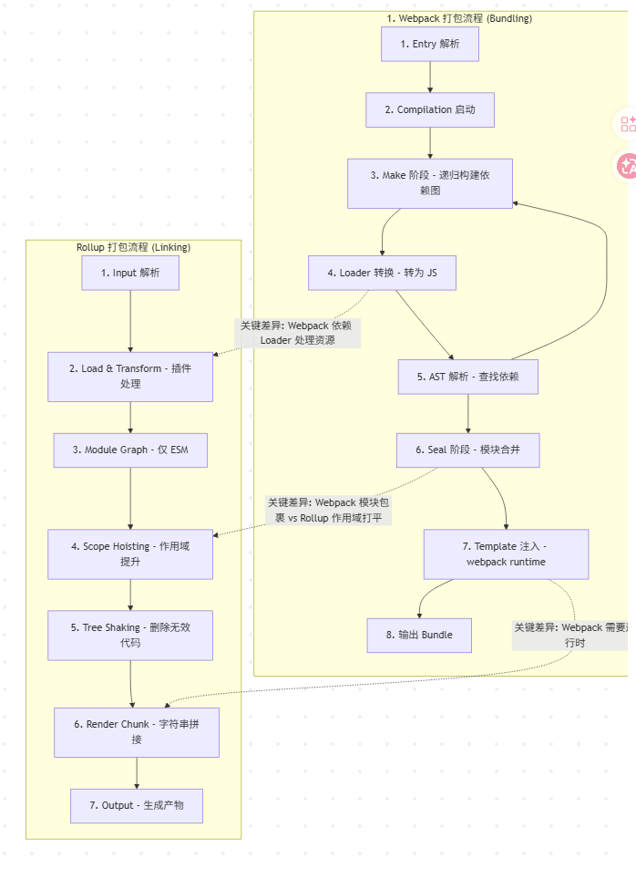

## 对比结论（先看这个）

- Webpack：以"构建应用"为目标，面向多类型资源与复杂运行时能力（chunk、runtime、动态加载）。
- Rollup：以"打包库"为目标，偏向输出更"干净"的 ESM/CJS，Scope Hoisting + 更激进的 Tree Shaking。

---

## Webpack 的核心逻辑

### 1）Make 阶段（递归构造依赖图）

- 从入口出发，通过 Resolver 找到每个文件。
- 遇到非 JS 资源（如 `.vue` / `.scss`）时，通过 Loader 将其转换成 JS 模块。

### 2）模块封闭性（Function Wrapper）

- 每个文件在 Webpack 中是一个独立闭包。
- 为了让模块互相通信，最终产物会注入 Runtime（例如 `__webpack_require__`）。

### 3）适用场景

- 大型 Web 应用。
- 支持 Code Splitting、动态加载、各种静态资源（图片/字体）与复杂依赖关系。

---

## Rollup 的核心逻辑

### 1）Scope Hoisting（作用域提升）

- 将模块代码"打平"到更少的函数/作用域中。
- 模块之间闭包隔离更少，产物更接近"一个大文件"。

### 2）Tree Shaking（摇树优化）

- 基于静态 `import/export` 分析未使用代码。
- 在打包阶段直接移除未用导出，通常更精准。

### 3）无感打包（产物更干净）

- 产物往往没有太多额外包裹代码。
- 如果源码是 ESM，输出也更接近原生 ESM。

### 4）适用场景

- JS 库（Library）。
- 更小包体、更高执行效率、更适合被第三方引用。

---

> 记忆点：Webpack = 应用打包器（runtime + 生态能力强）；Rollup = 库打包器（产物干净 + tree-shaking 强）。
